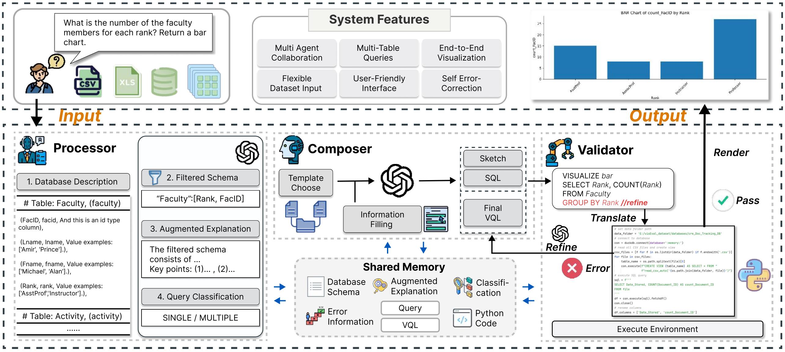

# 👾nvAgent

## 🙌Introduction

Hi! This is the official repository for the paper ["nvAgent: Automated Visualization from Natural Language via Collaborative Agent Workflow"](https://xxxxxxxxxxxxxx).

In this paper, we propose a novel multi-agent framework that integrates preprocessing, *Visualization Query Language* (VQL) generation, and a third stage for output validation and refinement. This comprehensive approach enables *nvAgent* to manage the full complexity of the NL2Vis process, ensuring accuracy and relevance at each step.



## 🎮Demo

We conduct an web interface to demonstrate how to use ***nvAgent*** to generate visualizations from natural language description. Upload .csv files and enter your requirement to generate visualizations simply.

We implement the interface in `web_vis`, and here is an demonstration.


## 🎉Updates

## ⚙️Project Structure

This repo is organized as follows:

```txt
├─core
|  ├─agents.py       # define three agents class
|  ├─api_config.py   # config API key and base
|  ├─chat_manager.py # manage the communication between agents
|  ├─const.py        # prompt templates
|  ├─llm.py          # config llm api call and write logs
|  ├─utils.py        # contains utils functions
├─web_vis # the interface for nvAgent
|  ├─core
|  ├─templates
|  ├─app.py
├─visEval # the evaluation framework
|  ├─check # contains different check aspects
|  ├─dataset.py # generate the dataset path mapping
|  ├─evaluate.py # evaluate the score of agent
├─run_evaluate.py # evaluation script
├─README.md
├─requirements.txt
├─visEval_dataset.zip # the dataset used for evaluation
```

## ⚡Start

To start with this project, there are several steps you can follow:

1. Set up your local environment

- Create a virtual environment for the project. The recommended Python version is 3.9 or higher.

```bash
conda create -n nvagent python=3.9
conda env list
conda activate nvagent
```

- Use the provided `requirements.txt` file to install the necessary dependencies.

```bash
pip install -r requirements.txt
```

Note:
If there is any conflict in your packages, try to reinstall them again individually. 

```bash
pip uninstall package_name
pip install package_name
```

2. Config your API, and file paths.


3. Run `llm.py` to test your api config, and run `chat_manager.py` to test nvAgent. (you can find test examples in `visEval.json` in `visEval_dataset`)

## 🎰Evaluation


## 💡Citation

If you find our work is helpful, please cite as:

```text

```

## 🪶Contributing

We welcome contributions and suggestions!
