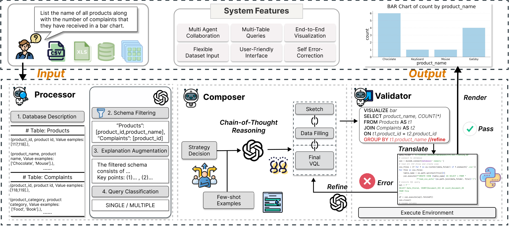

# NL2Vis

[](https://arxiv.org/abs/2502.05036) [](https://www.python.org/downloads/)

This is a fork of the official repository for the paper ["nvAgent: Automated Data Visualization from Natural Language via Collaborative Agent Workflow"](https://arxiv.org/abs/2502.05036).

## Introduction

**nvAgent** is a collaborative multi-agent system that converts natural language queries into data visualizations. It uses a three-agent workflow:

1. **Processor**: Filters database schema to relevant tables and columns
2. **Composer**: Plans the visualization type and approach
3. **Validator**: Generates and executes matplotlib code, validates output

This fork evaluates LLM-based chart generation on the VisEval benchmark, with support for local vLLM inference and ablation studies.



## Prerequisites

Before you begin, ensure you have:

- **Python 3.12 or higher**
- **Linux environment** (primary target; WSL2 on Windows works)
- **NVIDIA GPU with CUDA** (for local vLLM inference)
- **Minimum 16GB GPU memory** recommended for most models

## Quick Start

Follow these steps to run your first evaluation:

### 1. Clone and Setup Environment

```bash
# Clone the repository
cd /path/to/NL2Vis

# Create virtual environment
python3 -m venv .venv
source .venv/bin/activate

# Install dependencies
pip install -r requirements.txt
```

### 2. Extract the Dataset

The VisEval dataset must be extracted before running evaluations:

```bash
# Extract the dataset zip file
unzip viseval_dataset.zip

# Verify extraction (should show viseval_dataset/ directory)
ls -la viseval_dataset/
```

**Important**: The code expects the dataset at `viseval_dataset/` (lowercase). If you see `visEval_dataset/`, rename it:

```bash
mv visEval_dataset viseval_dataset
```

### 3. Configure the System

Edit `core/config.py` to set your inference backend. Two main modes:

**Option A: Local vLLM (recommended for this fork)**

```python
# In core/config.py
USE_VLLM = True
VLLM_MODEL_NAME = "Qwen/Qwen2.5-Coder-14B-Instruct-AWQ"  # or your preferred model
VLLM_GPU_MEMORY_UTILIZATION = 0.9
```

**Option B: Azure OpenAI API**

```python
# In core/config.py
USE_VLLM = False
# Set Azure credentials (API key, endpoint, deployment name)
```

For a complete configuration reference, see the comments in `core/config.py`.

### 4. Start Model Server (if using vLLM)

If you set `USE_VLLM = True`, start the vLLM server:

```bash
# In a separate terminal
source .venv/bin/activate
python -m core.vllm_server
```

**Wait for the server to load the model** (you'll see "Application startup complete" in the logs). This can take 2-5 minutes depending on your GPU.

Verify the server is running:

```bash
curl http://localhost:8000/v1/models
```

### 5. Run a Test Evaluation

Test with a small subset first (50 examples):

```bash
python run_evaluate_test.py 50
```

This will:
- Process 50 examples from the VisEval dataset
- Generate visualizations using the agent workflow
- Evaluate results across multiple aspects (chart type, data accuracy, layout, etc.)
- Save results to `results/<timestamp>_<model>_<vision_backend>/`

Expected runtime: 10-30 minutes depending on model and GPU.

### 6. Run Full Evaluation

Once the test works, run the complete evaluation:

```bash
python run_evaluate.py
```

This processes the entire VisEval dataset (typically 700+ examples) and can take several hours.

## Understanding Results

After evaluation completes, results are saved in `results/<timestamp>_<model>_<vision_backend>/`:

```
results/
└── 20260504_143000_Qwen2.5-Coder-14B-Instruct-AWQ_NoVision/
    ├── single_scores.json    # Single-table scenario scores
    ├── multi_scores.json     # Multi-table scenario scores
    └── logs/                 # Detailed per-example logs
```

### Key Metrics

Each evaluation includes these checks:

- **Execution**: Does the generated code run without errors?
- **Surface Form**: Is visualization code present in the response?
- **Chart Type**: Does the chart match the requested type (bar, line, scatter, etc.)?
- **Data**: Is the correct data displayed?
- **Order**: Are sorted/ordered elements correct?
- **Layout**: Are axes, legends, and labels properly placed?
- **Scale**: Are axis scales appropriate?
- **Readability**: Overall chart quality (if vision model enabled)

### Analyzing Results

Use the provided analysis scripts:

```bash
# Aggregate scores across runs
python results/analyze_results.py results/<your_result_folder>

# Compare single-table vs multi-table performance
python results/analyze_single_multi.py results/<your_result_folder>
```

## Project Structure

```txt
├── core/
│   ├── agents.py              # Processor, Composer, Validator agent classes
│   ├── chat_manager.py        # Agent communication coordinator
│   ├── config.py              # Centralized runtime configuration
│   ├── const.py               # Prompt templates for agents
│   ├── llm.py                 # Azure OpenAI client
│   ├── vllm_client.py         # vLLM local inference client
│   ├── vllm_server.py         # vLLM server startup script
│   ├── openai_vision_client.py    # OpenAI vision API client
│   ├── vision_vllm_client.py      # Local vision model client
│   ├── vision_vllm_server.py      # Vision model server
│   └── utils.py               # Utility functions
├── tests/
│   ├── test_vllm_suite.py     # vLLM setup validation
│   ├── test_visual_agent.py   # Vision pipeline checks
│   └── test_chromedriver.py   # Selenium/chromedriver tests
├── viseval/
│   ├── check/                 # Evaluation aspect checkers
│   │   ├── chart_check.py         # Chart type validation
│   │   ├── data_check.py          # Data accuracy validation
│   │   ├── layout_check.py        # Layout correctness
│   │   ├── order_check.py         # Element ordering
│   │   ├── scale_and_ticks_check.py  # Axis scale validation
│   │   ├── readability_check.py   # Vision-based quality
│   │   ├── surface_form_check.py  # Code presence check
│   │   └── deconstruct.py         # Chart element parsing
│   ├── dataset.py             # Dataset path mapping
│   └── evaluate.py            # Main evaluation logic
├── results/
│   ├── analyze_results.py         # Aggregate scoring script
│   └── analyze_single_multi.py    # Single vs multi-table comparison
├── web_vis/                   # Streamlit web interface (optional)
├── run_evaluate.py            # Full evaluation script
├── run_evaluate_test.py       # Subset evaluation script
├── run_ablation.py            # Ablation study runner
├── requirements.txt           # Python dependencies
├── pyproject.toml            # Project metadata
└── viseval_dataset.zip       # VisEval benchmark dataset (extract before use)
```

## Advanced Usage

### Running Ablation Studies

Test different agent configurations:

```bash
python run_ablation.py --model qwen14b

# Dry run (test config without evaluation)
python run_ablation.py --model qwen14b --dry-run
```

Available configurations tested:
- `full`: All agents enabled (baseline)
- `no_processor`: Skip schema filtering
- `no_composer_template`: Use simplified planning prompts
- `no_validator`: Skip code execution validation
- Combinations of the above

### Testing Your Setup

Validate your vLLM installation:

```bash
# Run all checks
python tests/test_vllm_suite.py --all

# Individual checks
python tests/test_vllm_suite.py --setup      # Check environment
python tests/test_vllm_suite.py --server     # Check server connection
python tests/test_vllm_suite.py --integration  # End-to-end test
```

### Vision Model Setup (Optional)

To enable chart quality evaluation with a vision model:

1. **Option A: Use OpenAI Vision API**

```python
# In core/config.py
USE_OPENAI_VISION = True
OPENAI_VISION_MODEL_NAME = "gpt-4o-mini"
# Set OPENAI_API_KEY in environment or config
```

2. **Option B: Use Local Vision Model**

```python
# In core/config.py
USE_VISION_VLLM = True
VISION_VLLM_MODEL_NAME = "Qwen/Qwen2-VL-7B-Instruct-AWQ"
```

Then start the vision server:

```bash
python -m core.vision_vllm_server
```

Verify:

```bash
curl http://localhost:8001/v1/models
```

## Troubleshooting

### Common Issues

**"CUDA out of memory" error**

Reduce GPU memory utilization in `core/config.py`:

```python
VLLM_GPU_MEMORY_UTILIZATION = 0.7  # Lower from 0.9
```

Or enable quantization:

```python
VLLM_QUANTIZATION = "awq"  # or "fp8"
```

**Server connection refused**

Ensure the vLLM server is running and fully loaded:

```bash
# Check server logs for "Application startup complete"
# Test endpoint
curl http://localhost:8000/v1/models
```

**Dataset not found**

Verify the dataset is extracted and in the correct location:

```bash
ls -la viseval_dataset/
# Should show single/ and multiple/ subdirectories
```

**Import errors after installation**

Ensure virtual environment is activated:

```bash
source .venv/bin/activate
which python  # Should point to .venv/bin/python
```

### Getting Help

- Check `core/config.py` comments for configuration guidance
- Review test scripts in `tests/` for setup validation
- Examine example results in `results/` to understand output format
- See CLAUDE.md for detailed architecture and development notes

## Platform Notes

### Windows Users

If running on Windows (not WSL), activate the virtual environment with:

```powershell
.venv\Scripts\Activate.ps1
```

Note: This codebase is Linux-first. Use forward slashes in paths and Unix conventions throughout.
